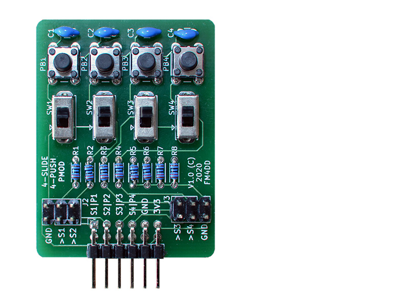
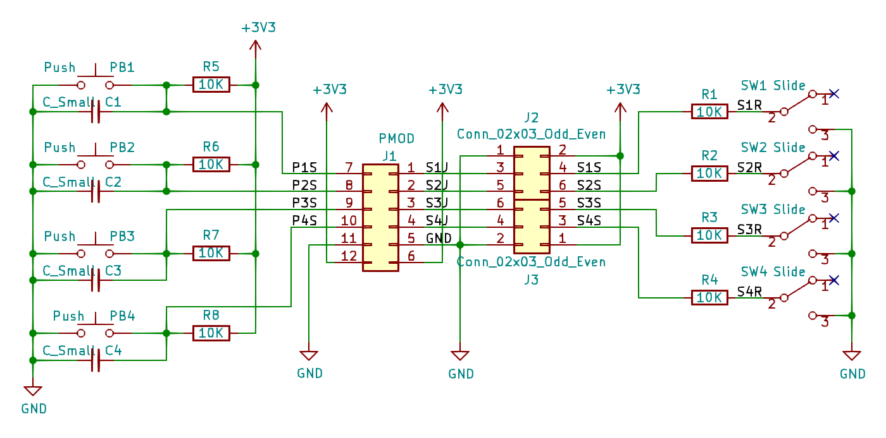
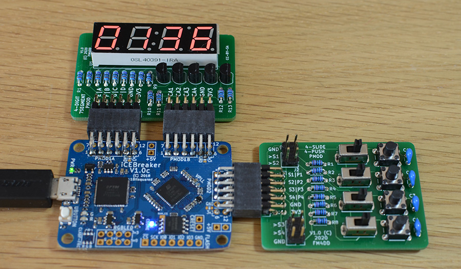
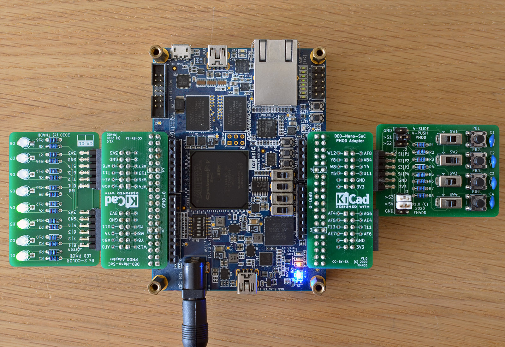

## TSLIDE4 PMOD

### Description



This PMOD provides four slide switch and four touch-button inputs to FPGA designs via a single double-row PMOD. The four slide switches can be individually disabled through two sets of jumpers (J2 and J3, signal S1-S4). This can free up IO pins on the IceBreaker v1.0 board if only push-buttons are needed. The Icebreaker has only 24 multi-purpose IO, which creates a challenge for advanced designs. Push buttons use inverse logic, the button press creates a "LOW" signal.

http://fpga.fm4dd.com/

### Schematic

[](images/tslide4-schema.png)

### PCB Gerber

[20200301 TSLIDE4 Gerber v1.1](20200301-tslide4-gerber-v11.zip)

### Pin Assignments

#### IceBreaker v1.0

TSLIDE4 PMOD, connected to a Icebreaker v1.0 board

 J1# |  Label | Description   | PMOD1A| PMOD1B | PMOD2
-----|--------|---------------|-------|--------|-------
1    |  SW1   | Slide Switch1 | 4     | 43     | 27
2    |  SW2   | Slide Switch2 | 2     | 38     | 25
3    |  SW3   | Slide Switch3 | 47    | 34     | 21
4    |  SW4   | Slide Switch4 | 45    | 31     | 19
7    |  PB1   | Push Button1  | 3     | 42     | 26
8    |  PB2   | Push Button2  | 48    | 36     | 23
9    |  PB3   | Push Button3  | 46    | 32     | 20
10   |  PB4   | Push Button4  | 44    | 28     | 18

#### DE0-Nano-SoC

The connection to Intels DE0-Nano-SoC is made through the pmod2nano adapter.


 J1# |  Label | Description   | GPIO0A | GPIO0B | GPIO1A | GPIO1B
-----|--------|---------------|--------|--------|--------|--------
1    |  PB1   | Push Button1  | PIN_W12| PIN_AF4|PIN_AA15| PIN_AH23
2    |  PB2   | Push Button2  | PIN_Y8 | PIN_AF5|PIN_AG26| PIN_AE19
3    |  PB3   | Push Button3  | PIN_W8 | PIN_T13|PIN_AF23| PIN_AD19
4    |  PB4   | Push Button4  | PIN_Y5 | PIN_AE7|PIN_AF21| PIN_AE24
7    |  SW1   | Slide Switch1 | PIN_AF8| PIN_AG6|PIN_AH27| PIN_AG23
8    |  SW2   | Slide Switch2 | PIN_AB4| PIN_AE4|PIN_AH24| PIN_AF18
9    |  SW3   | Slide Switch3 | PIN_Y4 | PIN_T11|PIN_AE22| PIN_AE20
10   |  SW4   | Slide Switch4 | PIN_U11| PIN_AF6|PIN_AG20| PIN_AD20

### Example Code

#### Verilog



Below is a test program to verify the correct function of the TSLIDE4 PMOD.
The programm assumes an additional 8LED2 PMOD connected to show LED output.

The design links the four slide switches with LED D1-D4 in green color,
and the four push button switches with LED D5-D8 in red color.

Operating the switches simply turns the corresponding LED on or off.

Verilog test program pmod_tslide4_1.v (top-level):
```
// -------------------------------------------------------
// This program tests HW pin assignment for TSlide4 pmods
// -------------------------------------------------------
module pmod_tslide4_1 (
  input SW1,
  input SW2,
  input SW3,
  input SW4,
  input PB1,
  input PB2,
  input PB3,
  input PB4,
  output reg [0:7] pmodledg,
  output reg [0:7] pmodledr
);

always
begin
  // pmodledg[0] = 1'b1;  // light up D1
  pmodledg[0] = SW1;
  pmodledg[1] = SW2;
  pmodledg[2] = SW3;
  pmodledg[3] = SW4;
  pmodledr[7] = ~PB1;
  pmodledr[6] = ~PB2;
  pmodledr[5] = ~PB3;
  pmodledr[4] = ~PB4;
end
endmodule
```
#### VHDL

This is Verilog test program pmod_tslide4_1.v converted to VHDL as pmod_tslide4_2.vhd

```
-- -------------------------------------------------------
-- This program tests HW pin assignment for TSlide4 pmods
-- -------------------------------------------------------
library ieee;
use ieee.std_logic_1164.all;
use ieee.numeric_std.all;

entity pmod_tslide4_2 is
port ( SW1: in STD_LOGIC := '1';
       SW2: in STD_LOGIC := '1';
       SW3: in STD_LOGIC := '1';
       SW4: in STD_LOGIC := '1';
       PB1: in STD_LOGIC := '1';
       PB2: in STD_LOGIC := '1';
       PB3: in STD_LOGIC := '1';
       PB4: in STD_LOGIC := '1';
  pmodledg: out STD_LOGIC_VECTOR(0 to 7) := "00000000";
  pmodledr: out STD_LOGIC_VECTOR(0 to 7) := "00000000"
);
end pmod_tslide4_2;

architecture arch of pmod_tslide4_2 is
begin
  -- pmodledg(0) <= '1';  // light up D1
  pmodledg(0) <= SW1;
  pmodledg(1) <= SW2;
  pmodledg(2) <= SW3;
  pmodledg(3) <= SW4;

  pmodledr(4) <= NOT PB1;
  pmodledr(5) <= NOT PB2;
  pmodledr(6) <= NOT PB3;
  pmodledr(7) <= NOT PB4;
end arch;
```

