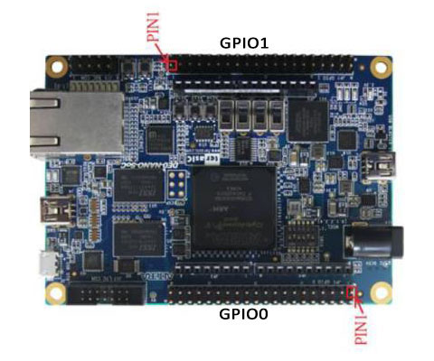

## TSLIDE4 PMOD

### Description


This PMOD provides four slide switch and four touch-button inputs to FPGA designs via a single double-row PMOD. The four slide switches can be individually disabled through two sets of jumpers (J2 and J3, signal S1-S4). This can free up IO pins on the IceBreaker v1.0 board if only push-buttons are needed. The Icebreaker has only 24 multi-purpose IO, which creates a challenge for advanced designs. Push buttons use inverse logic, the button press creates a "LOW" signal.

http://fpga.fm4dd.com/

### Schematic

[](images/tslide4-schema.png)

### PCB Gerber

[20200301 TSLIDE4 Gerber v1.1](20200301-tslide4-gerber-v11.zip)

### Pin Assignments

#### IceBreaker v1.0

TSLIDE4 PMOD, connected to a Icebreaker v1.0 board

 J1# |  Label | Description   | PMOD1A| PMOD1B | PMOD2
-----|--------|---------------|-------|--------|-------
1    |  SW1   | Slide Switch1 | 4     | 43     | 27
2    |  SW2   | Slide Switch2 | 2     | 38     | 25
3    |  SW3   | Slide Switch3 | 47    | 34     | 21
4    |  SW4   | Slide Switch4 | 45    | 31     | 19
7    |  PB1   | Push Button1  | 3     | 42     | 26
8    |  PB2   | Push Button2  | 48    | 36     | 23
9    |  PB3   | Push Button3  | 46    | 32     | 20
10   |  PB4   | Push Button4  | 44    | 28     | 18

#### DE0-Nano-SoC

The connection to Intels DE0-Nano-SoC is made through the pmod2nano adapter.



 J1# |  Label | Description   | GPIO0A | GPIO0B | GPIO1A | GPIO1B
-----|--------|---------------|--------|--------|--------|--------
1    |  SW1   | Slide Switch1 | PIN_W12| PIN_AF4|PIN_AA15| PIN_AH23
2    |  SW2   | Slide Switch2 | PIN_Y8 | PIN_AF5|PIN_AG26| PIN_AE19
3    |  SW3   | Slide Switch3 | PIN_W8 | PIN_T13|PIN_AF23| PIN_AD19
4    |  SW4   | Slide Switch4 | PIN_Y5 | PIN_AE7|PIN_AF21| PIN_AE24
7    |  PB5   | Push Button1  | PIN_AF8| PIN_AG6|PIN_AH27| PIN_AG23
8    |  PB6   | Push Button2  | PIN_AB4| PIN_AE4|PIN_AH24| PIN_AF18
9    |  PB7   | Push Button3  | PIN_Y4 | PIN_T11|PIN_AE22| PIN_AE20
10   |  PB8   | Push Button4  | PIN_U11| PIN_AF6|PIN_AG20| PIN_AD20

### Example Code

#### Verilog

Below is a test program to verify the correct function of the TSLIDE4 PMOD.
The programm assumes an additional 8LED2 PMOD connected to show LED output.

The design links the four slide switches with LED D1-D4 in green color,
and the four push button switches with LED D5-D8 in red color.

Operating the switches simply turns the corresponding LED on or off.

Verilog test program pmod_tslide4_1.v (top-level):
```
// -------------------------------------------------------
// This program tests HW pin assignment for TSlide4 pmods
// -------------------------------------------------------
module pmod_tslide4_1 (
  input SW1,
  input SW2,
  input SW3,
  input SW4,
  input PB1,
  input PB2,
  input PB3,
  input PB4,
  output [0:7] pmodledg,
  output [0:7] pmodledr
);
reg [0:3] SW;
reg [0:3] PB;
assign pmodledg[0] = SW[0];
assign pmodledg[1] = SW[1];
assign pmodledg[2] = SW[2];
assign pmodledg[3] = SW[3];
assign pmodledr[7] = PB[0];
assign pmodledr[6] = PB[1];
assign pmodledr[5] = PB[2];
assign pmodledr[4] = PB[3];

always
begin
  // led = 1'b1;  // light up D1
  SW[0] = SW1;
  SW[1] = SW2;
  SW[2] = SW3;
  SW[3] = SW4;
  PB[0] = PB1;
  PB[1] = PB2;
  PB[2] = PB3;
  PB[3] = PB4;
end
endmodule
```


